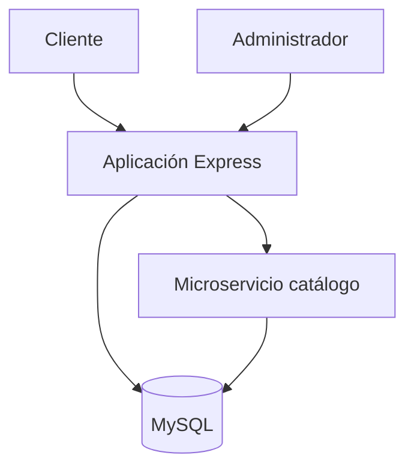

# Portafolio de servicios - Los Magueyes

## Portada

**Proyecto final: Backend con Node.js**  
**Aplicación:** Sistema web para Los Magueyes  
**Giro:** Restaurante de barbacoa estilo Hidalgo  
**Alumno:** Escribe aquí tu nombre y matrícula  
**Fecha:** Escribe la fecha de entrega

## Índice

1. Planteamiento y objetivo
2. Avance 1 - Servidor y asincronía
3. Avance 2 - Aplicación modular y segura
4. Avance 3 - Base de datos, CRUD y pruebas
5. Avance 4 - Docker, microservicios y optimización
6. Integración final
7. Reflexiones y conclusiones

## 1. Planteamiento y objetivo

Los Magueyes requiere un medio digital para presentar su menú, recibir pedidos y mantener actualizada la información de sus productos. La solución integra una interfaz pública y un panel protegido para el personal. El objetivo es disminuir errores al capturar pedidos, centralizar precios y facilitar el mantenimiento del catálogo.

## 2. Avance 1 - Servidor y asincronía

Se configuró Node.js, `npm` y Express. `server.js` inicia el servicio después de verificar de forma asíncrona la conexión con MySQL. El endpoint `/health` permite confirmar que la aplicación está activa.

**Evidencia sugerida 1:** terminal después de ejecutar `node --version` y `npm --version`.  
**Evidencia sugerida 2:** terminal con `npm run dev`.  
**Evidencia sugerida 3:** navegador mostrando `http://localhost:3000/health`.

**Reflexión:** La espera de la conexión antes de abrir el puerto evita presentar una aplicación aparentemente activa cuando su base de datos no está disponible.

## 3. Avance 2 - Aplicación modular y segura

La aplicación separa rutas, controladores, middleware, vistas y archivos públicos. La autenticación utiliza sesiones y bcrypt. Helmet agrega cabeceras seguras; el limitador reduce intentos repetidos; Express Validator revisa las entradas; EJS escapa la salida y las consultas usan parámetros.

**Evidencia sugerida 4:** estructura de carpetas en Visual Studio Code.  
**Evidencia sugerida 5:** formulario de inicio de sesión.  
**Evidencia sugerida 6:** intento de entrar a `/admin` sin iniciar sesión.

**Reflexión:** La seguridad se implementó por capas. Ninguna validación aislada sustituye la autenticación, autorización, cifrado y consultas parametrizadas.

## 4. Avance 3 - Base de datos, CRUD y pruebas

MySQL conserva usuarios, categorías, productos, pedidos y detalles. Las llaves foráneas protegen las relaciones. El panel permite crear, consultar, modificar y desactivar productos. Los pedidos se guardan dentro de una transacción y el servidor vuelve a calcular los importes para impedir que el navegador altere precios.

**Evidencia sugerida 7:** phpMyAdmin mostrando las seis tablas.  
**Evidencia sugerida 8:** menú digital con productos.  
**Evidencia sugerida 9:** formulario de nuevo producto.  
**Evidencia sugerida 10:** pedido en el panel administrativo.  
**Evidencia sugerida 11:** terminal mostrando las pruebas aprobadas con `npm test`.

**Reflexión:** La transacción asegura que un pedido y sus partidas se registren juntos o que ninguno se conserve cuando ocurre un error.

## 5. Avance 4 - Docker, microservicios y optimización

Docker Compose define la aplicación, MySQL y el microservicio de catálogo. El servicio independiente expone `/api/catalog`. Se agregaron índices para las búsquedas frecuentes por categoría, disponibilidad, estado y fecha. El pool limita y reutiliza conexiones.

**Evidencia sugerida 12:** `docker compose ps`.  
**Evidencia sugerida 13:** `http://localhost:4001/health`.  
**Evidencia sugerida 14:** catálogo JSON del microservicio.

**Reflexión:** Separar el catálogo demuestra cómo una responsabilidad puede escalar de manera independiente. Docker hace que el entorno sea repetible.

## 6. Integración final

El cliente consulta productos disponibles, forma un carrito y envía el pedido. El servidor valida los datos, consulta los precios reales, calcula el total y registra todo en MySQL. El personal accede al panel, revisa los pedidos y actualiza su estado.

## 7. Conclusiones

El proyecto cumple una necesidad real del restaurante al digitalizar el catálogo y los pedidos. Node.js permitió integrar interfaces, API, seguridad, persistencia, pruebas y contenedores. La organización modular facilita incorporar posteriormente inventario, pagos, reportes y notificaciones sin rehacer la aplicación.

## Lista de verificación antes de entregar

- Sustituir nombre, matrícula y fecha de la portada.
- Tomar las 14 capturas sugeridas, numerarlas y agregar un título.
- No mostrar contraseñas en capturas.
- Ejecutar `npm test` y guardar la evidencia.
- Verificar menú, carrito, inicio de sesión, CRUD y estados de pedido.
- Convertir este contenido a Word o PDF con portada e índice.
